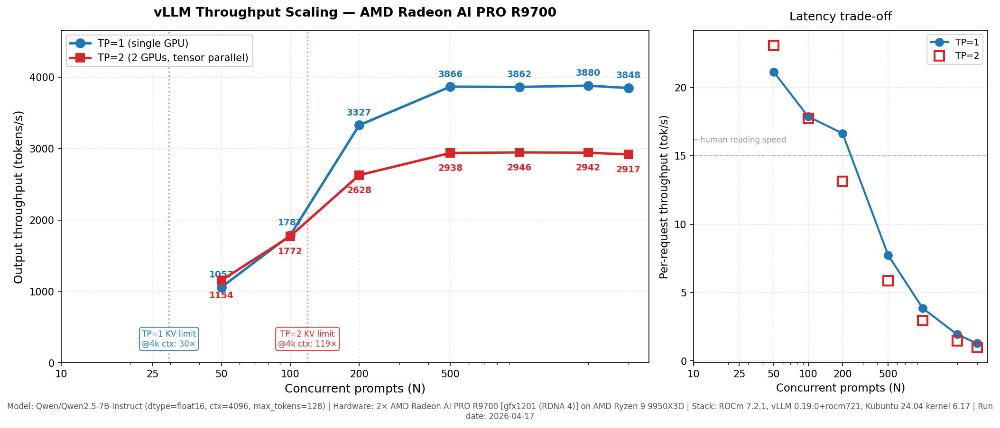

# NaviMed-UMB

Engineering log of a local AI / LLM workstation build — hardware, power
infrastructure, ROCm environment, and reproducible benchmarks for
modern open-weight models on consumer-grade AMD RDNA 4 GPUs.

> **Security note:** This repository documents a workstation build and
> experiments. Operational details such as hostnames, domains, network
> addresses, and secrets are intentionally omitted.

---

## Hardware

| Component | Model |
|---|---|
| CPU | AMD Ryzen 9 9950X3D |
| GPU | 2x GIGABYTE Radeon AI PRO R9700 AI TOP 32G (gfx1201, RDNA 4 / Navi 48) |
| Motherboard | ASUS ProArt X870E |
| RAM | Corsair 96 GB DDR5-6000 CL30 (2x48 GB) |
| Storage | GOODRAM PX700 4 TB + 1 TB NVMe |
| PSU | FSP PTM PRO 1650 W 80+ Platinum (ATX 3.1) |
| Cooling | Noctua NH-D15 G2 + 2x NF-A14 |
| Case | ASUS ProArt PA602 |
| UPS | ARMAC 2000 Online (NUT-monitored) |
| OS | Kubuntu 24.04 LTS, kernel 6.17, ROCm 7.2.1 |

See [`bom/readme.md`](bom/readme.md) for the full bill of materials,
power topology, and PCIe layout.

## Software stack

Snapshot from 2026-04-26 (release v0.1.0):

| Component | Version |
|---|---|
| Python | 3.12.3 |
| vLLM | 0.19.0 (ROCm 7.2.1 wheel) |
| PyTorch | 2.10.0+git8514f05 |
| HIP | 7.2.53211 |
| flash-attn | 2.8.3 |
| triton | 3.6.0 |
| transformers | 4.57.6 |

Full pip freeze and system manifests are archived in
[`environment/`](environment/) for full reproducibility of all
benchmark runs in this release.

## Repository layout

| Directory | Contents |
|---|---|
| [`bom/`](bom/) | Hardware BOM, power infrastructure, PCIe topology, UPS |
| [`benchmarks/`](benchmarks/) | vLLM / ROCm / PyTorch benchmarks, methodology, results |
| [`ai-workstation-dashboard/`](ai-workstation-dashboard/) | Real-time CPU/GPU monitoring (FastAPI + psutil + rocm-smi) — [screenshot](ai-workstation-dashboard/assets/Screenshot_AI_Workstation_Dashboard.png) |
| [`environment/`](environment/) | Dated environment manifests for reproducibility |
| [`docs/sessions/`](docs/sessions/) | Long-form session reports (engineering studies, debugging logs) |
| [`logbook/`](logbook/) | Short chronological diary entries from the build process |

## Highlights

### Qwen 2.5 7B Instruct — concurrency scaling (April 2026)

Full concurrency sweep on vLLM 0.19 with both tensor-parallel
configurations, including per-run thermal instrumentation.

Key measurements:

- TP=1 plateau: 3870 tok/s (saturates from N=500, std dev 0.3%)
- TP=2 plateau: 2940 tok/s (24% PCIe all_reduce tax vs TP=1)
- TP=2 only wins at N=50 (+9%), loses at every higher concurrency
- Thermal asymmetry between GPU 0 and GPU 1 (5C delta, airflow-dependent)

See
[`benchmarks/results/qwen2.5-7b-fp16/README.md`](benchmarks/results/qwen2.5-7b-fp16/README.md)
for the full writeup, all 14 measurement points, and methodology.

### Qwen 3.6 27B — practical envelope on 2x R9700 (v0.1.0)

First documented working configuration of Qwen 3.6 27B (released
2026-04-22) on this hardware. Both FP8 and BF16 variants reach
inference; both require `tensor_parallel_size=2` and
`enforce_eager=True` due to a CUDA-graph capture incompatibility on
gfx1201.

**Working configurations for Qwen 3.6 27B on 2× R9700:**

| Quantization | TP | enforce_eager | max_len | Memory util | Weights/GPU | KV cache | Cold tok/s |
|---|---|---|---|---|---|---|---|
| BF16 | 2 | true | 1024 | 0.95 | 25.76 GiB | 2.68 GiB | **7.23** |
| FP8 | 2 | true | 2048 | 0.85 | 15.35 GiB | 7.53 GiB | 4.15 |

A counter-intuitive finding: under vLLM 0.19.0, **BF16 outpaces FP8 by
approximately 75%** on R9700 (cold first inference: 7.23 vs
4.15 tok/s). The cause is the absence of R9700-specific FP8 kernel
configurations in vLLM, forcing the runtime onto a generic block-FP8
fallback path.

Full debugging trail, working configs table, environment variable
corrections, and cross-reference to CUDA llama.cpp baselines:
[`docs/sessions/2026-04-26-qwen36-vllm-envelope.md`](docs/sessions/2026-04-26-qwen36-vllm-envelope.md).

## v0.1.0 release

This release captures the engineering snapshot as of 2026-04-26: 13
benchmark models downloaded (~770 GB), validated working
configurations for Qwen 3.6 27B in both quantizations, and the full
software/hardware environment archived for reproducibility.

The release scope is strictly empirical: hardware/software envelope
measurements on this workstation. No claims are made in this release
about specific applications, downstream use cases, or future research
directions; those will be addressed in subsequent releases as the work
progresses.

For the canonical citation, see [`CITATION.cff`](CITATION.cff) or use
the **"Cite this repository"** button on GitHub.

A preprint extracting the empirical envelope findings into paper form
is in preparation: see [`paper/`](paper/).

## Status

- Hardware assembled and validated (2026-02-28 / 2026-03-04)
- ROCm 7.2.1 + PyTorch validation (2026-03-08)
- UPS monitoring operational (NUT + nutdrv_qx, 2026-03-30)
- AI workstation dashboard deployed (systemd autostart)
- vLLM 0.19 + ROCm 7.2.1 stack validated (2026-04-17)
- Qwen 2.5 7B Instruct: TP=1 vs TP=2 scaling sweep with thermal data (2026-04-22)
- Qwen 2.5 72B AWQ: pilot benchmark on TP=2 (2026-04-23)
- 13-model benchmark suite assembled (~770 GB, 2026-04-25)
- Qwen 3.6 27B envelope on R9700 / gfx1201 (2026-04-26, **v0.1.0**)

## AI assistance

This work was developed with assistance from generative AI tools
(Claude Opus 4.7 web and Claude Code CLI; GPT-5.5 Deep Thinking web)
used as research assistants for documentation, debugging dialogue, and
sounding-board discussion. All experimental design, hardware
configuration, empirical measurements, and scientific claims are the
sole responsibility of the author. Full disclosure:
[`AI_USAGE_DISCLOSURE.md`](AI_USAGE_DISCLOSURE.md).

## License

This repository uses **dual licensing**:

- **Code** (Python scripts, dashboard, shell, configuration files)
  is licensed under the [MIT License](LICENSE-CODE).
- **Documentation, methodology, lab logs, and benchmark findings**
  are licensed under [Creative Commons Attribution 4.0 International
  (CC BY 4.0)](LICENSE).

For citation, see [`CITATION.cff`](CITATION.cff) or use the
"Cite this repository" button on GitHub.

## Author

**Łukasz Minarowski, MD, PhD**
Department of Respiratory Physiopathology
Medical University of Białystok, Poland
ORCID: [0000-0002-2536-3508](https://orcid.org/0000-0002-2536-3508)
Email: lukasz.minarowski@umb.edu.pl

---

*This is the engineering log of an academic build with all the
seriousness that implies, and a little less. For a non-serious take
on the LLM benchmarking landscape, see
[`benchmarks/assets/battle_of_LLM_models_gemini.png`](benchmarks/assets/battle_of_LLM_models_gemini.png).*
