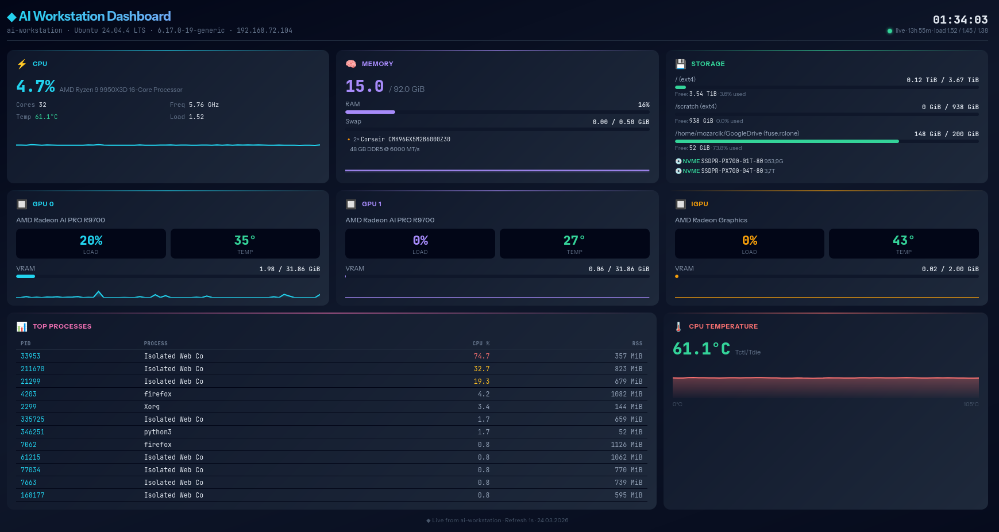

# AI Workstation Dashboard

##Dashboard Preview


Real-time system monitoring dashboard for AMD AI workstations.
Built for: Ryzen 9 9950X3D + 2× Radeon AI PRO R9700 + Kubuntu 24.04

## Quick Start

```bash
tar xzf ai-dashboard.tar.gz
cd ai-dashboard
chmod +x setup.sh start.sh

# One-time setup (creates .venv, installs deps):
./setup.sh

# Launch:
./start.sh
```

Open **http://localhost:8000** in your browser.

> `start.sh` will auto-run `setup.sh` if the venv doesn't exist yet,
> so you can skip straight to `./start.sh` if you prefer.

## What it monitors

- **CPU** — usage %, temperature (k10temp Tctl/Tdie), frequency, load average, 60s sparkline
- **RAM / Swap** — usage with gauge bars and sparkline
- **Disk** — root partition usage
- **GPUs** — all detected GPUs (2× discrete R9700 + iGPU) — load %, temp, VRAM, sparklines
- **Processes** — top 12 by CPU usage
- **CPU Temperature** — dedicated panel with 60s history graph

## Architecture

```
.venv/                     ← isolated Python environment
backend/
  server.py                ← FastAPI + psutil + rocm-smi
  requirements.txt
  frontend/
    index.html             ← self-contained dashboard (no build step)
setup.sh                   ← creates venv, installs deps
start.sh                   ← launches server from venv
ai-dashboard.service       ← systemd unit for autostart
```

## Endpoints

| Endpoint           | Description                    |
|--------------------|--------------------------------|
| `GET /`            | Dashboard UI                   |
| `GET /api/snapshot`| Single JSON snapshot (polling) |
| `WS /ws`           | Real-time stream (1s ticks)    |

## Access from other devices

Server binds to `0.0.0.0:8000`:

```
http://192.168.72.104:8000
```

## Autostart with systemd

```bash
sudo cp ai-dashboard.service /etc/systemd/system/
sudo systemctl daemon-reload
sudo systemctl enable --now ai-dashboard

# Check status:
sudo systemctl status ai-dashboard

# View logs:
journalctl -u ai-dashboard -f
```

## Requirements

- Python 3.10+ with `python3-venv`
- `rocm-smi` for GPU metrics (optional — dashboard works without it)

```bash
# If python3-venv is missing:
sudo apt install python3-venv

# For GPU support:
sudo apt install rocm-smi-lib
```

## Updating

```bash
cd ~/ai-dashboard
.venv/bin/pip install --upgrade -r backend/requirements.txt
sudo systemctl restart ai-dashboard   # if using systemd
```

